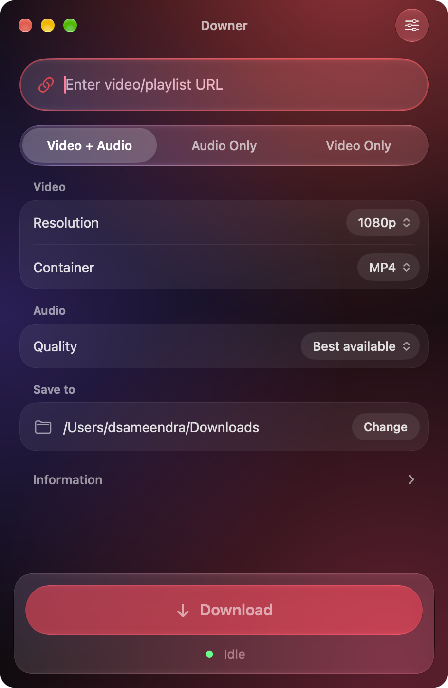
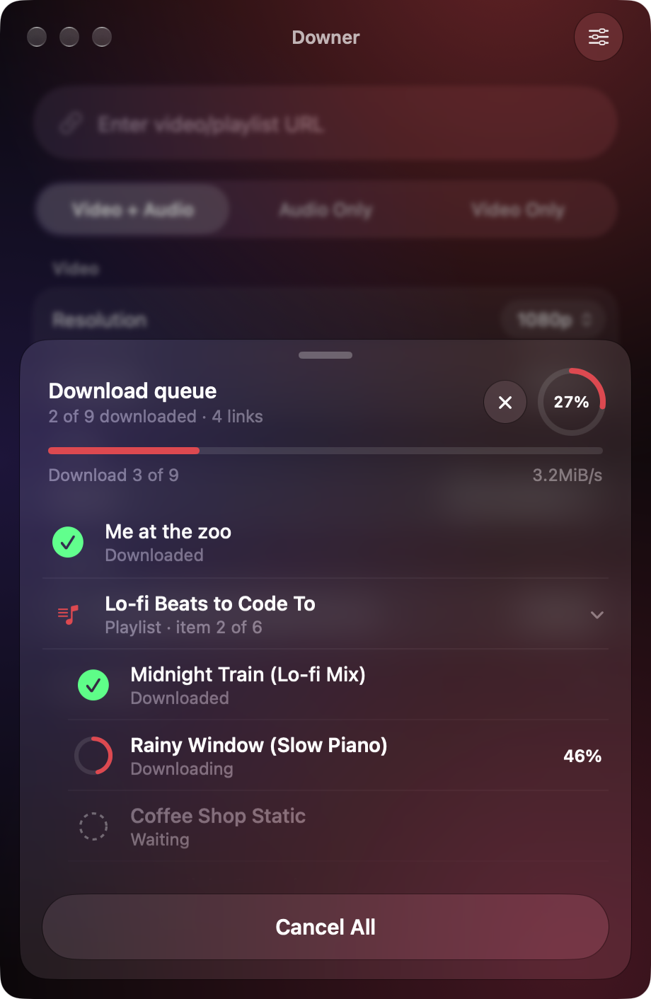
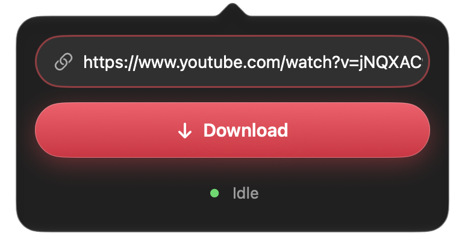
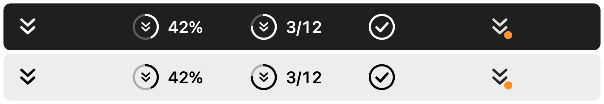
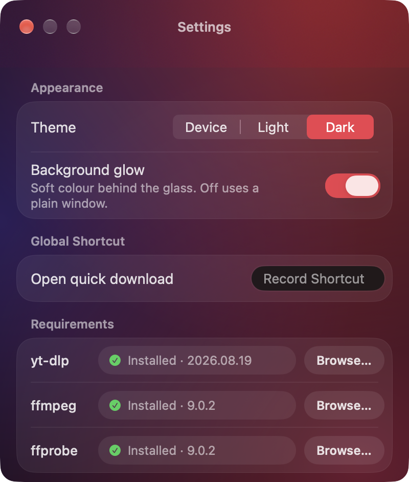
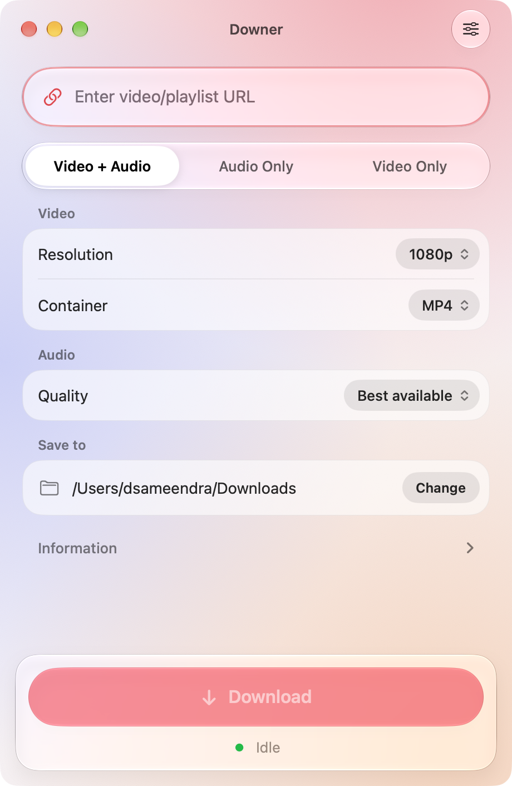
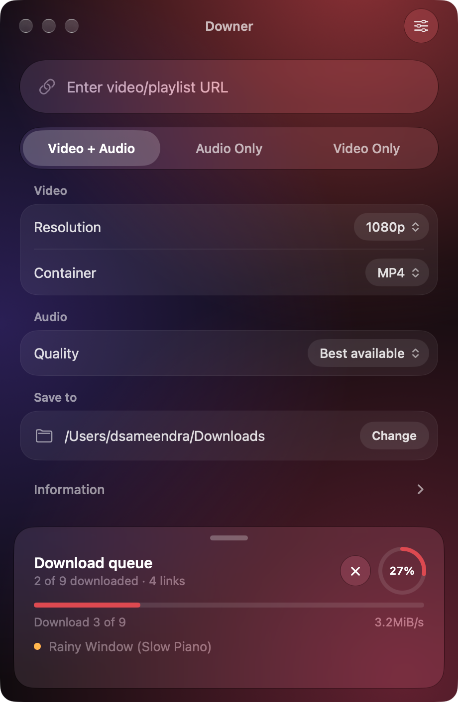
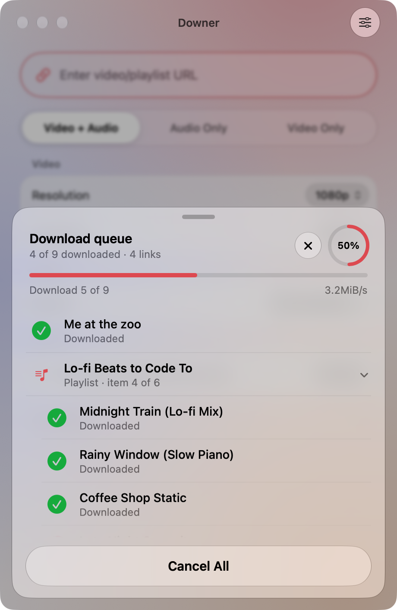

<div align="center">


# Downer

**A native macOS app for downloading video and audio. Paste a link, add as many more as you like, and let Downer work through them in order.**

Built for macOS 26 with Liquid Glass. Works on macOS 14 and later.

&nbsp;&nbsp;

</div>

## What's new in 2.0.2

- **Made for the trackpad.** Swipe up with two fingers on the download tray to open it, down to tuck it away; it follows your fingers, glides to rest with the speed of your swipe, and hands over to the list when you reach the top.
- **Swipe a row** sideways with two fingers to remove, cancel, retry or reveal it. A long swipe does the main action.
- **Drag to reorder.** Press and hold a waiting link, then drag it to change when it downloads.
- **Drop links in.** Drag a link from your browser onto the window or the menu bar icon.
- **Glass controls.** The download type is a glass switcher you can swipe; the pickers open as glass lists.
- **Menu bar popover:** swipe up to open the full window, down to dismiss.
- **Haptics.** Subtle feedback on a trackpad (turn it off in Settings). Reduce Motion is respected everywhere. Every gesture also has a click, keyboard or VoiceOver equivalent.

## What's new in 2.0

- **Liquid Glass design.** Real glass on macOS 26 and later, a refined material look on macOS 14 and 15, and solid surfaces when Reduce Transparency is on.
- **A download queue.** Add a video, a playlist, or several of each while something is already downloading. Everything is looked up first, then downloaded one after another.
- **Playlists done properly.** A playlist shows up as a group with one row per video, each with its own progress. Failed videos can be retried on their own.
- **Real progress.** A true progress bar and percentage, speed and time left, instead of raw tool output.
- **Set up from Settings.** Downer finds `yt-dlp`, `ffmpeg` and `ffprobe`, and can install them for you.
- **A smarter menu bar.** A new icon that fills with progress and shows the queue count, plus a global shortcut that opens the popover with your copied link already filled in.
- **A new app icon** built in layers for Liquid Glass, with dark, clear and tinted looks.
- **Appearance options.** Follow the device, or choose light or dark, and turn the background glow on or off.

## Features

### Downloading

- Download **video + audio**, **audio only**, or **video only**.
- Choose the **resolution** (from 240p up to 8K, capped at what the video offers), the **container** (MP4, MKV or WebM), the **audio quality** (best available, or capped at 128, 70 or 50 kbps), and the **audio format** (keep the source, or convert to MP3, AAC or Opus).
- Pick where files are saved. Every choice is remembered, and shared between the window and the menu bar.
- Each queued link keeps the settings it was added with, so changing a setting later never affects links that are already waiting.

### The queue

- **Add at any time.** Paste a link and press Return, or press **Add to Queue**. The field clears so you can paste the next one. Pasting several links at once adds them all.
- **Mix freely.** Single videos, playlists, or any combination. Links that are not valid, or are already in the queue, are ignored politely.
- **One at a time, in order.** Downloads run strictly one after another, so your connection and your disk are never hammered.
- **A tray that comes up from the bottom.** With more than one link, or a playlist, the download area becomes a tray. Drag the handle up to see every link and every video, drag it back down to tuck it away. Tap the header to toggle.
- **Control each item.** Remove a waiting link, cancel the one running, cancel everything, retry what failed, or clear what finished.
- **Automatic retry.** A network hiccup (for example an HTTP error) is retried once on its own. Links that are genuinely unavailable are not.
- **Show in Finder** reveals every file the queue produced.

### Menu bar and shortcut

- Downer lives in the menu bar. Click the icon for a compact popover with a link field and a Download button.
- Set a **global shortcut** in Settings. Copy a link anywhere, press the shortcut, and the popover opens with the link already filled in. Press Return to start.

<div align="center">

</div>

| Menu bar icon | Meaning |
|---|---|
| Double chevron | Idle |
| Ring with a percentage | Downloading one video |
| Ring with `3/12` | Downloading from a queue or a playlist (video 3 of 12) |
| Check mark | Finished (shown for a couple of seconds) |
| Orange dot | Something needs attention: a tool is missing, or a download failed |

<div align="center">

</div>

### Settings

<div align="center">

</div>

- **Appearance:** Device, Light or Dark, and an optional background glow.
- **Global shortcut:** record any key combination.
- **Requirements:** shows whether `yt-dlp`, `ffmpeg` and `ffprobe` are installed, and their versions. Missing tools have an **Install** button.
  - With Homebrew installed, Downer runs `brew install` for you.
  - Without Homebrew, `yt-dlp` is downloaded from its official release into Downer's own folder. `ffmpeg` needs Homebrew, and Downer will tell you so.
  - Already installed somewhere else? Use **Browse…** to point Downer at it.

## Screenshots

<table align="center">
  <tr>
    <td align="center"><br/>Light mode</td>
    <td align="center"><br/>The tray, tucked away</td>
    <td align="center"><br/>The tray, open, in light mode</td>
  </tr>
</table>

## Using Downer

1. Open **Downer**, or click its menu bar icon.
2. Paste a video or playlist link and press **Return**.
3. Choose **Video + Audio**, **Audio Only** or **Video Only**, and the quality and format you want.
4. While it downloads, paste more links. They join the queue.
5. Drag the tray handle up whenever you want to see what is happening to each video.
6. When the queue finishes, press **Show in Finder**.

Closing the window hides it (and the Dock icon). Click the menu bar icon to bring it back, or right-click it for **Open Downer** and **Quit Downer**.

## Installation

### 1. Download and install

Head to the [GitHub Releases](https://github.com/dsameendra/Downer/releases) page and download the latest `.dmg`.

- Open the `.dmg`. A window appears with Downer and your Applications folder: drag **Downer** onto **Applications**.
- Open **Settings → Requirements** and press **Install** next to anything that is missing. (`ffmpeg` needs [Homebrew](https://brew.sh). You can also run `brew install yt-dlp ffmpeg` yourself.)

### 2. Allow the app to run

macOS may block the app, saying:

> "Downer.app can't be opened."

This happens because the app is not signed with a paid Apple Developer account. You can allow it with Terminal:

1. Sign the app locally with an ad-hoc signature:
   ```bash
   codesign --force --deep --sign - /Applications/Downer.app
   ```
2. Remove the quarantine flag so macOS treats it as safe:
   ```bash
   xattr -dr com.apple.quarantine /Applications/Downer.app
   ```

### 3. Folder access

The first time Downer saves into a protected folder such as Downloads, macOS asks whether to allow it. Choose **Allow**. You can change this later in **System Settings → Privacy & Security → Files & Folders**.

## Troubleshooting

| Problem | What to try |
|---|---|
| A "Setup needed" banner appears | Open Settings → Requirements and press Install next to what is missing. |
| **Install** is greyed out for ffmpeg | Install [Homebrew](https://brew.sh) first, then try again. |
| A video failed with an HTTP error | Downer retries these once automatically. If it still fails, press **Retry** on the row. |
| A video says "unavailable" | The video is private, removed or restricted in your region. Retrying will not help. |
| Nothing is saved | Check the **Save to** folder exists, and that Downer has permission to write to it. |
| Downloads suddenly stop working for a site | Update the tool: `brew upgrade yt-dlp` (sites change often). |

## Building from source

### Requirements

- macOS 14 or later to run. Xcode 26 or later to build, so the Liquid Glass APIs are available.
- `yt-dlp`, `ffmpeg` and `ffprobe` installed anywhere on disk, or installed from Downer's Settings.

### Steps

1. Clone the repository:
   ```bash
   git clone https://github.com/dsameendra/Downer.git
   cd Downer
   ```
2. Open `Downer.xcodeproj` in Xcode. The [KeyboardShortcuts](https://github.com/sindresorhus/KeyboardShortcuts) package is fetched automatically.
3. Choose your own signing team: select the **Downer** target, open **Signing & Capabilities**, and pick your team. Automatic signing is enough for local builds.
4. Build and run.

### Installing a local build

1. In Xcode choose **Product → Archive**.
2. In the Organizer choose **Distribute App → Custom → Copy App**.
3. Copy the exported `Downer.app` into `/Applications`.

### Making a release build

```bash
./scripts/make-dmg.sh
```

This builds a universal Release app, signs it ad hoc, draws the installer window and writes `dist/Downer-<version>.dmg` with a checksum next to it. It needs Xcode and Python 3; the DMG tool is installed into `dist/.venv` the first time.

### How it is put together

| File | Role |
|---|---|
| `DownloadManager.swift` | The queue: looks links up, runs `yt-dlp` one at a time, turns its output into progress |
| `DownloadJob.swift` | One queued link and the settings it was added with |
| `PlaylistModel.swift` | Follows a playlist run line by line (current video, progress, failures) |
| `QueueTray.swift` | The draggable tray with every link and video |
| `DependencyManager.swift` | Finds and installs `yt-dlp`, `ffmpeg` and `ffprobe` |
| `DesignSystem.swift` | Liquid Glass, materials, motion, buttons and window chrome |
| `MenuBarIcon.swift` | The menu bar icon and its states, drawn in code |
| `Downer.icon` | The layered app icon |
| `scripts/make-dmg.sh` | Builds the signed, universal installer DMG (`scripts/dmg` holds its window design) |

See [`PRODUCT.md`](PRODUCT.md) for who Downer is for and [`DESIGN.md`](DESIGN.md) for the design decisions behind it.

## Disclaimer

This tool is intended solely for personal use and educational or research purposes.

Downloading videos from YouTube may violate their [Terms of Service](https://www.youtube.com/t/terms) unless the video has an explicit download button or the content is licensed in a way that permits downloading.

By using this app, **you assume full responsibility** for any content you download and how you use it. The developer does not condone or support any misuse of this tool to infringe upon copyrights or violate platform rules.

---

Built with ❤️ using [yt-dlp](https://github.com/yt-dlp/yt-dlp) and [ffmpeg](https://www.ffmpeg.org). Huge credit to the amazing developers behind these tools.
